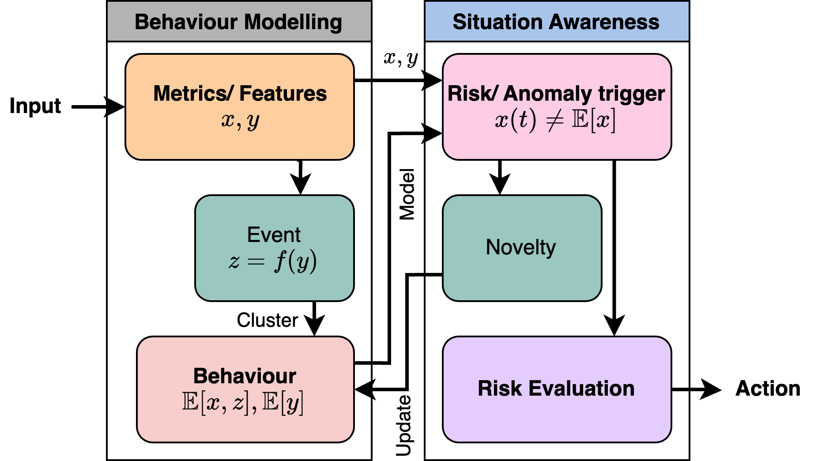
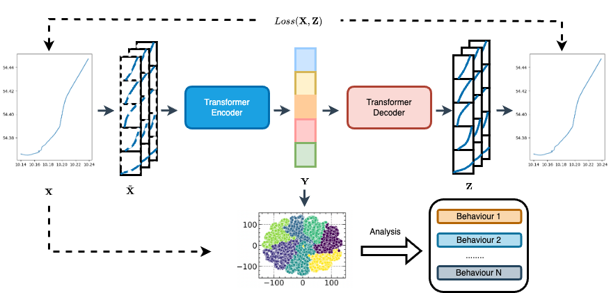

# Enhancing Maritime Behaviour Analysis through Novel Feature Engineering and Digital Shadow Modelling: A Case Study in Kiel Fjord

## Introduction
This repository contains an implementation of an extension and utilisation of
the Surface Vessel Nautical Behaviour Analysis (SV-NBA) framework for
in-depth spatio-temporal analysis of maritime surface vessels’ behaviour
in Kiel Fjord. 

## Requirements
To install all the requirements, one needs to first install:

+ conda
+ poetry

A detailed list of the required libraries can be found in:

+ poetry.toml

The proper installation must then be done with poetry and conda.

## Contributing

This framework illustrates a transformer-based autoencoder that takes input data X, transforms it into an intermediate representation Y through an encoder, and then reconstructs it into output Z using a decoder. During this process, a loss function Loss(X, Z) is used to optimize the model for accurate reconstruction of the input data. Finally, the intermediate representation Y is utilized for behavior analysis, categorizing data points into different behavior types.

## Authors and acknowledgment
[gaf, sga, lha]@informatik.uni-kiel.de

## License
We use the MIT license, see

+ LICENSE

## Citation
